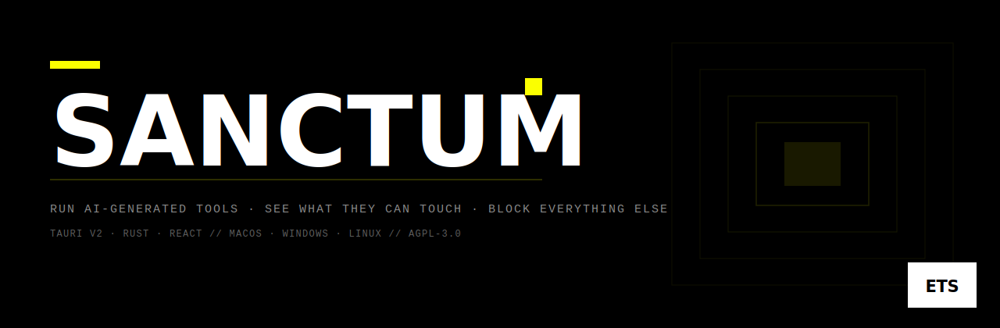

<p align="center">
  
</p>

<p align="center">
  <a href="LICENSE"></a>&nbsp;
  &nbsp;
  <a href="https://github.com/Enigma-Technologies-Solutions/sanctum/actions/workflows/ci.yml"></a>&nbsp;
  
</p>

<br>

AI tools are black boxes. Sanctum changes that.

Paste an HTML tool. Sanctum scans it, tells you exactly what it wants — camera, network endpoints, storage, geolocation — and lets you approve only what you're comfortable with. The tool runs in a hard-isolated sandbox with a dynamically built Content Security Policy matching your approvals. Everything else is blocked before the tool's code runs.

Built for people who run AI-generated tools but won't accept "trust me."

---

## How it works

| Step | What happens |
|------|-------------|
| **Ingest** | Paste from clipboard or load a file. SHA-256 stamps the content. Any subsequent tamper quarantines the tool permanently before it can run. |
| **Scan** | Static analysis extracts capability signals: `fetch` calls, `getUserMedia`, `WebSocket` endpoints, `navigator.geolocation`, storage APIs, USB / HID / Bluetooth, and more. Literal URL hostnames are extracted from source. |
| **Approve** | A per-capability permission manifest is shown. Toggle each one. Network access is per-host — approve only the endpoints the tool actually needs. |
| **Run** | Tool opens in an isolated window at its own web origin (`sanctum-tool://tool-{id}/`). CSP enforces your approvals. The Tauri IPC bridge is removed by an initialization script before the tool's code executes. |

---

## Security model

**Layers, in enforcement order:**

**1 — Origin isolation.** Each tool runs at a distinct `sanctum-tool://tool-{id}/` origin. `localStorage`, `IndexedDB`, cookies, and service workers are scoped per-origin by the WebView. Two tools can never read each other's storage.

**2 — CSP enforcement.** Default is `connect-src 'none'` with every fetch-type directive denied. Approved network hosts are injected as explicit `https://` and `wss://` entries at window creation. Nothing is relaxed unless you approved it.

**3 — IPC removal.** An initialization script deletes all `__TAURI__*` globals from the window before the tool's HTML is parsed. Tools have zero OS bridge access. The [tool capability set](src-tauri/capabilities/tool-default.json) is empty — all Tauri commands are denied even if IPC bootstrap is present.

**4 — Integrity check.** SHA-256 of the stored file is recomputed on every launch. Mismatch → `quarantined = 1` in the DB, window creation aborted, error shown. No exceptions.

**5 — Static scan (advisory only).** The scanner drives the permission manifest UI. It is not a security control. Capabilities hidden behind dynamic string construction, obfuscation, or CDN-loaded scripts may be missed. The sandbox enforces limits regardless.

> **What Sanctum does not prevent:** a tool using only the capabilities you approved, and then doing harmful things with them. Approve capabilities with the same care you'd give any permission prompt.

Detailed threat model and remaining v0 attack surface: see [SECURITY MODEL](#security-model-detail) below.  
Vulnerability disclosure policy: [SECURITY.md](SECURITY.md)  
Building tools that work within Sanctum: [SANCTUM_FOR_AGENTS.md](SANCTUM_FOR_AGENTS.md)

---

## Building from source

**Prerequisites:** Rust ≥ 1.77 · Node.js ≥ 20 · pnpm

```bash
git clone https://github.com/Enigma-Technologies-Solutions/sanctum
cd sanctum
pnpm install
pnpm tauri dev
```

Signed release builds require Apple Developer Program and Azure Trusted Signing credentials. See [.github/workflows/release.yml](.github/workflows/release.yml).

---

## Status

**v0** — working sandbox, build-from-source only. Not yet signed or distributed.

| Feature | Status |
|---------|--------|
| Paste / file ingest | ✓ |
| SHA-256 versioning + quarantine | ✓ |
| Static capability scanner | ✓ heuristic (regex) |
| Dynamic CSP from approvals | ✓ |
| Per-tool origin isolation | ✓ |
| IPC removal | ✓ |
| SQLite library (list, tag, rollback) | ✓ |
| Signed + notarized release builds | pending |
| Auto-updates | roadmap |
| AST-based scanner (catches obfuscation) | roadmap |
| Org policy file | roadmap |
| Tool registry / provenance | roadmap |

---

## Storage layout

```
{AppDataDir}/                      # macOS: ~/Library/Application Support/app.sanctum.dev
├── sanctum.db                     # SQLite — tool index, versions, manifests, approvals
└── tools/
    └── {tool_id}/                 # UUID v4
        └── versions/
            └── {sha256_hex}/      # content-addressed; immutable once written
                ├── index.html
                └── manifest.json  # derived capability manifest
```

No tool is ever executed from its original file path. Sanctum copies it into content-addressed storage first.

---

## Capability manifest

On ingest, Sanctum produces a derived manifest:

```json
{
  "name": "My AI Tool",
  "version": "1.0.1",
  "checksum": "sha256:3a4b5c...",
  "detected": ["camera", "microphone", {"net": ["api.example.com"]}, "storage"],
  "signature": null
}
```

Detected patterns:

| API pattern | Capability |
|-------------|-----------|
| `getUserMedia` | `camera` + `microphone` |
| `navigator.usb` | `usb` |
| `navigator.serial` | `serial` |
| `navigator.hid` | `hid` |
| `navigator.bluetooth` | `bluetooth` |
| `navigator.geolocation` / `getCurrentPosition` | `geolocation` |
| `new Notification` / `Notification.requestPermission` | `notifications` |
| `localStorage` / `sessionStorage` / `indexedDB` | `storage` |
| `fetch()` / `XMLHttpRequest` / `new WebSocket` + literal `https://` URLs | `{"net": ["hostname",...]}` |

Scanner limitations: dynamic string construction, obfuscated/minified code, CDN-loaded scripts. The sandbox enforces limits regardless of what the scan finds.

---

## Security model detail

### What Sanctum prevents

| Threat | Mitigation |
|--------|-----------|
| Tool reads host filesystem | Zero `fs` capability. Protocol handler serves only the tool's own version directory; path traversal blocked at component level + `canonicalize`. |
| Tool calls Tauri IPC / OS APIs | `initialization_script` deletes all `__TAURI__*` globals before HTML parsing. `tool-default` capability set is empty. |
| Tool exfiltrates data over network | CSP `connect-src 'none'` injected by the protocol handler on every response. Enforced at the WebView level. |
| One tool reads another's storage | Distinct `sanctum-tool://tool-{id}/` origins. Verified: write a key in tool-A's `localStorage`; tool-B (different ID) returns `null`. |
| Tampered stored file runs | SHA-256 recomputed on every `open_tool_window`. Mismatch → quarantine → no window. |
| Path traversal | Component-by-component check (reject `..`, absolute, prefix) + `canonicalize` confirmation. |

### What Sanctum does not prevent (v0, honest)

- **Phishing / fake UI** — a tool can display anything. The `⚠ Third-party tool` window title and capability summary are the only mitigations.
- **LAN timing probes** — `connect-src 'none'` blocks HTTP exfiltration but not timing-based side channels via `` data URIs.
- **Cross-tool CPU/memory timing** — same Tauri process; OS-level side channels exist.
- **Tool crashing the host** — tool window and host share one Tauri process. A WebKit crash in a tool takes down the app.

### Open source note

The host application is fully auditable. Open source does not vouch for third-party tools — every tool is untrusted until proven otherwise.

---

## Module map

```
src-tauri/src/
├── lib.rs              — app setup, sanctum-tool:// protocol handler, state
├── db.rs               — SQLite pool, migrations
├── models.rs           — ToolRecord, VersionRecord, ToolManifest, DetectedCapability
├── signing.rs          — Ed25519 verification seam (v1)
├── device_broker.rs    — hardware consent / elevation stub (v1)
├── policy.rs           — org policy file stub (v2)
├── registry.rs         — server-side provenance client stub (v3)
└── commands/
    ├── ingest.rs       — ingest_html, ingest_from_clipboard, ingest_from_path
    ├── library.rs      — list_tools, get_tool, update_metadata, delete_tool
    ├── versioning.rs   — create_version, rollback_version, compute_checksum
    ├── scan.rs         — scan_capabilities, capabilities_for_manifest
    ├── approvals.rs    — update_approvals
    └── runner.rs       — open_tool_window (integrity check + dynamic CSP + window)
```

---

## License

**Community:** [AGPL-3.0-only](LICENSE). Embedding Sanctum in a commercial product requires either open-sourcing that product under the same terms or a commercial license.

**Commercial licensing:** [ultra@enigma.sh](mailto:ultra@enigma.sh)

---

<p align="center">
  <sub>By <a href="https://enigma.sh">Enigma Technologies Solutions</a> &nbsp;·&nbsp; cryptography &amp; Web3 education</sub>
</p>
